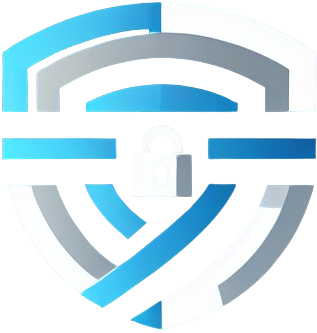

# CYBER4ALL

## 📖 Description
CYBER4ALL est une plateforme éducative dédiée à la cybersécurité, conçue pour démocratiser l'accès aux connaissances en sécurité informatique. Le site propose un glossaire complet des termes essentiels de la cybersécurité, permettant aux utilisateurs de tous niveaux de comprendre les concepts fondamentaux.
## 🎯 Objectifs

- Éducation accessible : Rendre la cybersécurité compréhensible pour tous
- Glossaire complet : Définitions claires des termes techniques
- Sensibilisation : Améliorer la culture de la sécurité informatique
- Ressource de référence : Outil pratique pour professionnels et étudiants

## 🔍 Contenu principal
Le site couvre notamment :
### Concepts fondamentaux

- Cyberattaques : Types d'attaques et méthodes de protection
- Hygiène informatique : Bonnes pratiques de sécurité
- Chiffrement : Systèmes de chiffrement et cryptographie
- Analyse de sécurité : Méthodes d'investigation et d'analyse

### Menaces spécifiques

- Malwares : Virus, trojans, ransomwares
- CryptoLocker : Ransomware et chiffrement malveillant
- Backdoors : Portes dérobées et accès non autorisés
- Catfishing : Usurpation d'identité en ligne
- Contrôle à distance : Prise de contrôle d'appareils

### Technologies de sécurité

- Fonctions de hachage : Empreintes numériques
- Chiffrement asymétrique : Clés publique/privée
- Cybersecurity Data Analytics : Analyse de données de sécurité

## 🚀 Utilisation
Le site est conçu pour être utilisé comme :

- Référence rapide pour les professionnels IT
- Support pédagogique pour les formations en cybersécurité
- Outil d'apprentissage pour les débutants
- Ressource de sensibilisation pour les entreprises

## 👥 Public cible

- Professionnels de la cybersécurité
- Étudiants en informatique
- Employés d'entreprises
- Particuliers soucieux de leur sécurité numérique
- Formateurs et enseignants
## 👥 Système de contribution communautaire
### Connexion contributeur
#### En tant que contributeur connecté, vous pouvez :

- Voter pour mettre en avant les termes les plus utiles
- Proposer de nouveaux mots-clés (soumis à validation)
- Participer activement à l'enrichissement du glossaire
- Gravir le classement communautaire
- Rejoindre une communauté engagée dans l'éducation cybersécurité

## 🚧 Développement en cours
### Interface d'administration
Une interface d'administration est actuellement en développement pour permettre :

- Gestion des termes du glossaire
- Modération du contenu
- Statistiques d'utilisation
- Configuration des paramètres du site
### Système de gamification

- Points de contribution pour chaque action
- Classement des contributeurs les plus actifs
- Badges de reconnaissance selon l'engagement
- Validation collaborative des nouveaux termes
Fonctionnalité à venir prochainement...
## 🌐 Accès
Le site est accessible à l'adresse : https://cyber4all.benjaminlorieul.fr/

## 🛡️ Philosophie
CYBER4ALL s'appuie sur la conviction que la cybersécurité ne doit pas être réservée aux experts. En rendant les concepts accessibles et en utilisant un langage clair, le site contribue à élever le niveau général de sécurité informatique.
### 📞 Contact
- Auteur : Benjamin Lorieul
- Site web : benjaminlorieul.fr

"La cybersécurité est l'affaire de tous - CYBER4ALL rend cette expertise accessible à chacun."